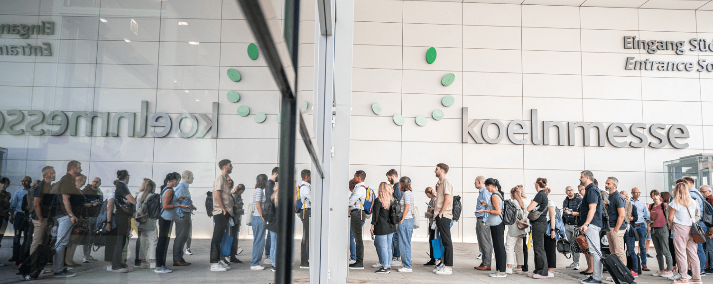

## Europe's leading Expo event dedicated to the world of work!

ZP Europe is different from the other HR Expo events. ZP is the number 1 event in Europe. A fixed star and established centre in the entire HR cosmos. With excellent industry expertise, a feel for trends and potential. And a clear mission. Like no other trade fair, the ZPE creates one thing above all: active access to the entire cluster of topics in the HR world. To the big players and innovative start-ups. To their new ideas, solutions and tools. Above all, however, the ZPE opens up space for open dialogue, creative networking and interdisciplinary transfer. For surprising synergies that make complex HR work manageable. And holistic. 360° value-adding and sustainable, so that employees can realise their full potential. A lively, collaborative platform for integrated people transformation.

